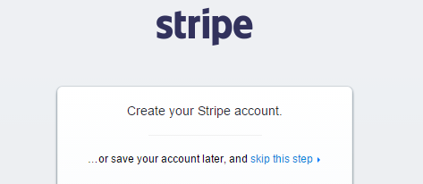
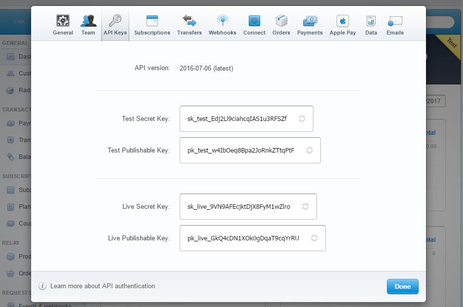
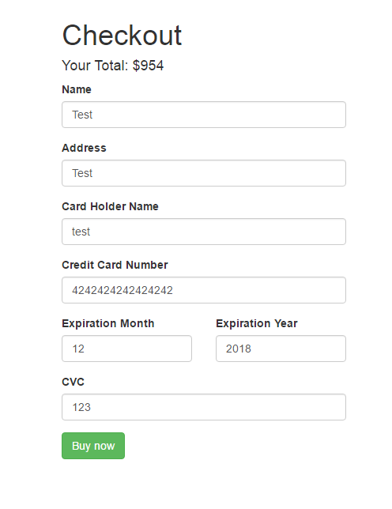

Configure the database in .env file

Locate the project folder destination in terminal

Type "php artisan migrate --seed"

Type "php artisan serve" to start

I'm using Stripe Test Payement

For Stripe Payments go to https://dashboard.stripe.com/register

Click skip this step to get into dashboard

If you are on dashboard, click "Your Account" on top left on page

Go Account Settings , then get the api keys

You will see like this,Do not copy key from this image.

Copy the Test Secret Key in Stripe Dashboard site.

Paste into App\Http\Controllers\ProductController setApiKey in line 73.

Copy the Test Publishable Key in Stripe Dashboard site again.

Paste into resources\views\shop\checkout.blade.php  setPublishableKey in line 74.

Then we will fill form like this

Copy 4242424242424242 for test card number

Done!
